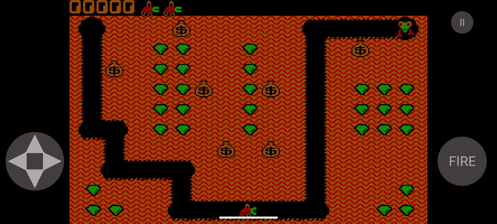

# Digger Android

Android-порт классической игры [Digger](https://en.wikipedia.org/wiki/Digger_(video_game)) — с сохранением оригинального ощущения: пиксельная CGA-графика 320×200, фиксированный игровой темп, классические уровни, мешки с золотом, монстры, бонусы и очки.



## Откуда взялся этот проект

Игру Digger в 1983 году выпустила компания Windmill Software, основанная Дэном Гудманом (Dan Goodman) — для DOS. Со временем игра была портирована на множество платформ, включая Commodore 64 и Amiga.

Этот проект — не порт с нуля, а следующее звено в цепочке портов:

1. Оригинал 1983 года (DOS, Windmill Software).
2. Java-клон [mortihead/digger](https://github.com/mortihead/digger) — портирован на Java из C-кода апплета 1998 года, с сохранением оригинальной графики и звуков. Используются только стандартные библиотеки JDK, отрисовка на AWT.
3. **Этот репозиторий** — Android-порт версии (2), выполненный поэтапно по [roadmap.md](roadmap.md): собственный игровой цикл, виртуальный CGA-буфер 320×200 с letterbox-масштабированием под экран устройства, тач-управление (D-pad + кнопка огня) поверх той же игровой логики (клеточное движение, столкновения с мешками и монстрами, прокопка поля), перенесённой с сохранением максимальной верности оригиналу.

## О самой игре

Digger — классическая игра про шахтёра, который прокапывает пещеру, собирает изумруды и золото из мешков, уклоняется от монстров (или отстреливается от них) и не даёт упавшим мешкам себя раздавить. За прохождение уровня и сбор сокровищ начисляются очки, за определённый порог очков даются дополнительные жизни.

## Управление

- Виртуальный D-pad — направление движения Digger'а (клеточное: 4px по горизонтали, 3px по вертикали, повороты на перпендикулярную ось — только после выравнивания по сетке).
- Кнопка **FIRE** — выстрел в текущем направлении.
- Кнопка паузы (⏸) в правом верхнем углу.
- Поддерживается и аппаратная/host-клавиатура (стрелки — движение), например при запуске в эмуляторе.

## Сборка и запуск

Требуется JDK 17+ и Android SDK (либо просто Android Studio).

```bash
git clone git@github.com:mortihead/digger-android.git
cd digger-android

# Debug-сборка и установка на подключённое устройство/эмулятор
./gradlew installDebug

# Прогон unit-тестов игровой логики
./gradlew test
```

## Релизные сборки

Релизные APK собираются автоматически GitHub Actions ([.github/workflows/release.yml](.github/workflows/release.yml)) при пуше тега вида `v*` (например, `v1.0`) и публикуются вложением `digger-android-<тег>.apk` к соответствующему [GitHub Release](../../releases).

APK подписан общим "коммьюнити"-ключом, закоммиченным в репозиторий ([app/keystore/release.jks](app/keystore/release.jks)) — production-ключа для публикации в Google Play пока не заведено. Важно, что ключ один и тот же для ЛЮБОЙ релизной сборки (локальной и из CI): в отличие от отладочного ключа Android SDK (который на каждой машине/раннере генерируется заново со случайным содержимым), этот ключ даёт стабильную подпись, поэтому все релизы взаимно совместимы по обновлению через `adb install -r` или обычный sideloading. Если раньше на устройство ставился debug-билд (например, напрямую из Android Studio) — его нужно удалить перед установкой релизного APK один раз, дальше конфликтов подписи быть не должно.

Собрать релизный APK локально:

```bash
./gradlew assembleRelease
# результат: app/build/outputs/apk/release/app-release.apk
```

## Лицензия

Проект распространяется по лицензии [GNU GPL v2](LICENSE) — как и оригинальный Java-порт, от которого он унаследован.
